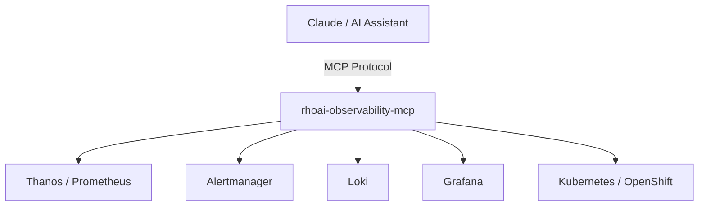

# Red Hat OpenShift AI (RHOAI) Observability MCP

[](https://github.com/amito/rhoai-observability-mcp/actions/workflows/ci.yml)
[](https://github.com/amito/rhoai-observability-mcp/actions/workflows/container-build.yml)
[](https://codecov.io/gh/amito/rhoai-observability-mcp)
[](https://www.python.org)
[](LICENSE)

An MCP (Model Context Protocol) server that gives AI assistants direct access to Red Hat OpenShift AI observability data. Query Prometheus metrics, Alertmanager alerts, Loki logs, Grafana dashboards, and Kubernetes cluster state to troubleshoot vLLM inference workloads.

## Features

- **17 tools** across 6 categories for comprehensive observability
- **vLLM-aware** metrics (TTFT, TPOT, E2E latency, KV cache, queue depth)
- **Composite investigation** tools that correlate metrics, logs, and alerts automatically
- **Auto-detection** of in-cluster vs external access to OpenShift services
- Built on [FastMCP](https://github.com/jlowin/fastmcp) with async backends via `httpx`

## Architecture



**Backends:**

| Backend | Purpose | Source |
|---------|---------|-------|
| Prometheus (Thanos) | Metrics queries (PromQL) | `backends/prometheus.py` |
| Alertmanager | Active alerts and alert groups | `backends/alertmanager.py` |
| Loki | Log queries (LogQL) | `backends/loki.py` |
| Grafana | Dashboard discovery and panel queries | `backends/grafana.py` |
| Kubernetes (OpenShift) | Pods, events, nodes, InferenceServices | `backends/openshift.py` |

## Quick Start

```bash
# Clone and install
git clone https://github.com/amito/rhoai-observability-mcp.git
cd rhoai-observability-mcp
uv pip install -e ".[dev]"

# Configure (see INSTALL.md for all options)
export THANOS_URL=https://thanos-querier.openshift-monitoring.svc:9091
export ALERTMANAGER_URL=https://alertmanager-main.openshift-monitoring.svc:9093
export OPENSHIFT_TOKEN=$(oc whoami -t)

# Run
python -m rhoai_obs_mcp.server
```

See [INSTALL.md](INSTALL.md) for detailed setup, configuration, and Claude Desktop integration.

## Build & Deploy

### Build the container image

```bash
make build
```

Override the image name or tag:

```bash
make build IMAGE_NAME=quay.io/myorg/rhoai-observability-mcp IMAGE_TAG=v1.0.0
```

### Push to registry

```bash
make push
```

### Deploy to OpenShift

Prerequisites: `oc login` to your cluster and ensure the target namespace exists.

```bash
make deploy
```

This applies the manifests in `deploy/` to the current namespace.

### Undeploy

```bash
make undeploy
```

### CI-built images

Container images are automatically built from `main` and published to GHCR:

```
ghcr.io/amito/rhoai-observability-mcp:latest
```

## Tool Reference

### Metrics

| Tool | Description |
|------|-------------|
| `query_prometheus` | Execute a raw PromQL query against ThanosQuerier |
| `get_vllm_metrics` | Get a summary of key vLLM metrics (TTFT, TPOT, E2E, cache, queue) for a model |
| `list_metrics` | List available Prometheus metric names, optionally filtered by regex |

### Alerts

| Tool | Description |
|------|-------------|
| `get_alerts` | Get active alerts from Alertmanager, filterable by severity and labels |
| `get_alert_groups` | Get alerts grouped by their routing labels |

### Logs

| Tool | Description |
|------|-------------|
| `query_logs` | Execute a LogQL query against OpenShift LokiStack |
| `get_pod_logs` | Get logs for a specific pod by namespace and name |

### Cluster

| Tool | Description |
|------|-------------|
| `get_pods` | List pods in a namespace with status, restarts, and creation time |
| `get_events` | List Kubernetes events, filterable by resource and reason |
| `get_node_status` | Get node status, capacity, and GPU allocation info |
| `describe_resource` | Get detailed description of a Kubernetes resource |
| `get_inference_services` | List KServe InferenceService resources |

### Dashboards

| Tool | Description |
|------|-------------|
| `list_dashboards` | List available Grafana dashboards, filterable by tag or title |
| `get_dashboard_panels` | Get panels and their queries from a Grafana dashboard |

### Investigation

| Tool | Description |
|------|-------------|
| `investigate_latency` | Correlate latency metrics, error logs, and alerts for a vLLM model |
| `investigate_gpu` | Correlate GPU utilization, KV cache, queue depth, and pod status |
| `investigate_errors` | Correlate error logs, alerts, and Kubernetes events in a namespace |

## Documentation

- [INSTALL.md](INSTALL.md) -- Installation, configuration, and integration
- [TESTING.md](TESTING.md) -- Running tests and writing new ones
- [CONTRIBUTING.md](CONTRIBUTING.md) -- Development setup and contribution guidelines

## License

[MIT](LICENSE)
